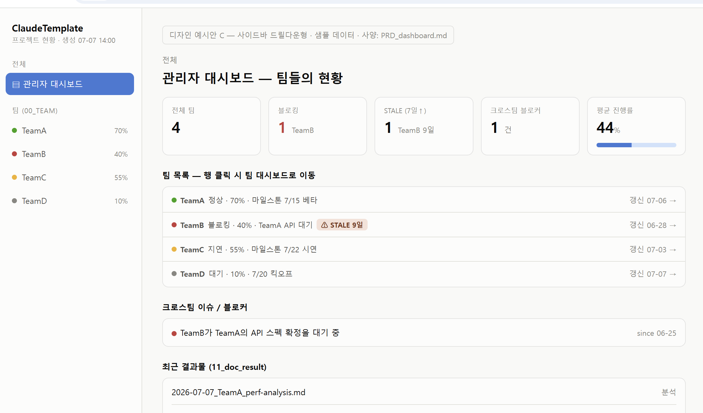
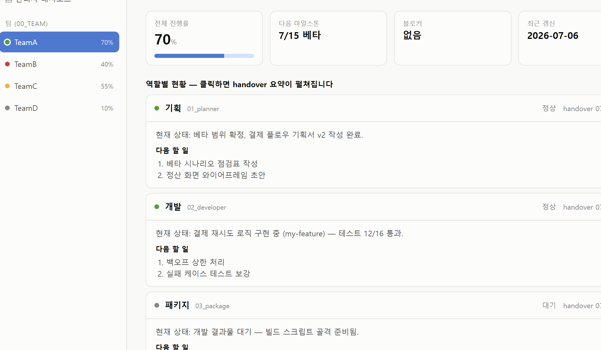
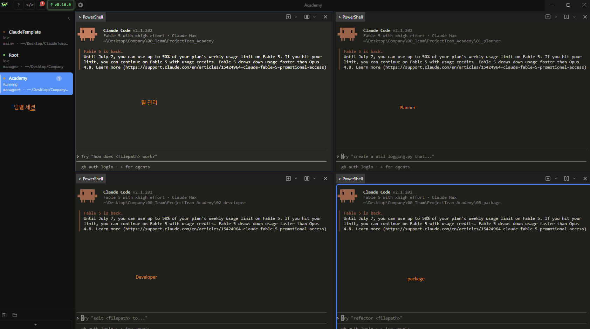
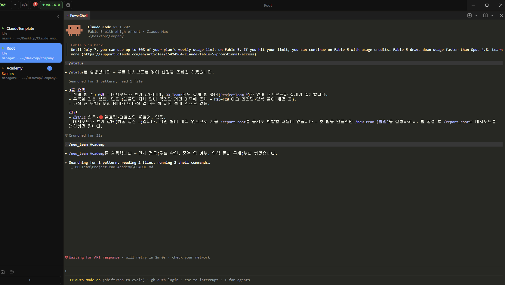

# ClaudeCodeTemplate

**Claude Code 1인 다프로젝트 운영 템플릿** — 회사의 업무 프로세스(팀·역할 구조)를 빌려, 혼자서 다량의 프로젝트를 분류·운영합니다. 같은 구조 그대로 다인 협업으로 확장할 수 있습니다.

> 처음이신가요? → **[main_manual.md](main_manual.md)** 하나만 읽으면 시작할 수 있습니다 (5분).

## 핵심 아이디어 3가지

| # | 아이디어 | 의미 |
|---|---|---|
| 1 | **폴더가 곧 역할** | 어느 폴더에서 `claude`를 켜는지가 역할과 권한을 정합니다 |
| 2 | **문서가 곧 기억** | 세션 컨텍스트는 휘발됩니다 — 끝날 때 `/handover`로 저장하고, 시작할 때 읽어 복원합니다 |
| 3 | **대시보드가 곧 현황** | `/report_root` 한 번으로 전 팀 현황이 HTML 대시보드로 갱신됩니다 |

**1인 사용 기본 모델 (2축)**: 팀 = 사업 영역 분류(예: WebDev / Creative / DataOps) · 역할 = 작업 모드(기획 → 개발 → 패키지) · 루트 = 주간 포트폴리오 리뷰. 상세: main_manual 8장.

## 미리보기

**HTML 대시보드** — `/report_root` 한 번이면 전 팀 현황이 단일 HTML 파일로 갱신됩니다. 외부 도구·네트워크 없이 브라우저로 열기만 하면 됩니다 (아래는 샘플 데이터 화면):



팀을 클릭하면 드릴다운 — 역할별 현황과 handover 요약이 펼쳐집니다:



**폴더가 곧 역할** — 같은 팀이라도 어느 폴더에서 세션을 여는지에 따라 팀 관리 / 기획 / 개발 / 패키지 모드로 나뉩니다:



**루트 = 총괄자** — `/status`로 전체 현황을 조회하고 `/new_team`으로 팀을 만듭니다:



## 빠른 시작

```
1. 루트 폴더에서 claude 실행       → 당신은 총괄자입니다
2. /new_team MyTeam               → 팀(사업 영역) 생성
3. 팀 폴더에서 /new_project my-app → 프로젝트 생성 (작업 폴더 + process 문서)
4. 역할 폴더에서 작업 → 끝나면 /handover
```

## 폴더 구조

```
(루트)
├── 00_Team/           팀 작업 공간 (ProjectTeam_{팀명} · 양식: _ProjectTeam_Template)
├── 01~04_*/           분석 역할 (Explorer·Educator·Critic·Advisor — /pipeline)
├── 10_Dashboard/      전체 현황판 (dashboard.html — 자동 생성, 직접 수정 금지)
├── 11_doc_result/     최종 결과물
├── 90_Templates/      표준 양식 원본
├── 99_Archive/        종료 프로젝트·구버전 보관
├── img/               README 이미지
└── manual/            상세 매뉴얼 (00~07)
```

## 주요 명령

| 명령 | 위치 | 하는 일 |
|---|---|---|
| `/new_team {팀명}` / `/new_project {이름}` | 루트 / 팀 | 팀·프로젝트 스캐폴딩 |
| `/handover` | 작업한 폴더 | 상태 문서 갱신 (세션 마무리 필수) |
| `/report` · `/report_root` | 팀 / 루트 | 보고서 + 대시보드 갱신 |
| `/status` | 루트·팀 | 현황 요약 조회 (읽기 전용) |
| `/dashboard` | 루트 | HTML 대시보드 갱신 (외부 도구 불필요) |
| `/pipeline {주제}` | 어디서나 | 탐색→설명→검증→권고 4단계 분석 |

## 문서 지도

| 문서 | 내용 |
|---|---|
| [main_manual.md](main_manual.md) | 처음 사용자용 안내서 (진입점) |
| [manual/](manual/) | 역할별 상세 매뉴얼·FAQ |
| [PRD.md](PRD.md) · [PRD_dashboard.md](PRD_dashboard.md) | 전체 사양 (v1.5) · 대시보드 사양 |
| [Tech.md](Tech.md) | 상태 점검 가이드 (불변식·동기화 지점) |

## 요구사항

[Claude Code](https://claude.com/claude-code)만 있으면 됩니다 — 파이썬 등 외부 도구 불필요, 대시보드는 오프라인(`file://`) 동작.
