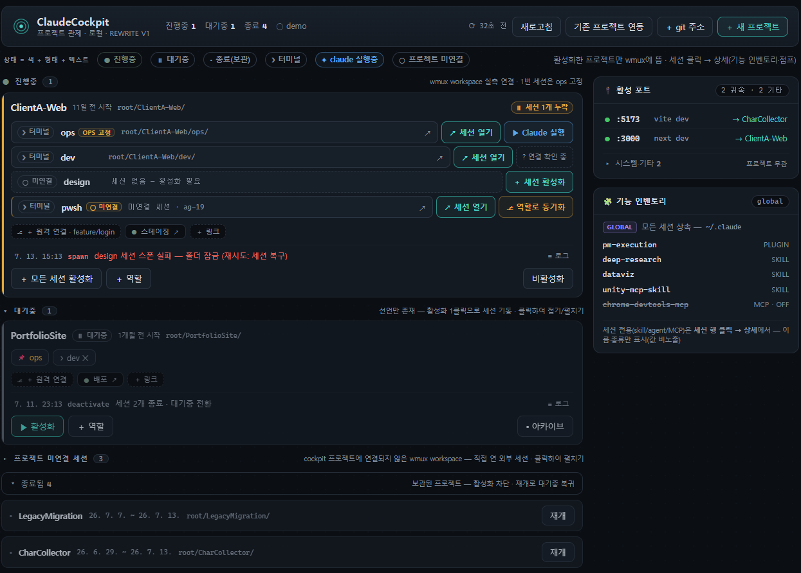

# Claude Cockpit

> 여러 Claude Code 세션을 **프로젝트별 · 역할별**로 한 대시보드에서 관찰·제어하는 로컬 관제 도구.
> 새 터미널 멀티플렉서를 만들지 않고, **wmux 위에 얇게 얹는 오케스트레이션 레이어**.

- **상태**: 실동작 — 대시보드가 실제 wmux에 붙어 프로젝트 생명주기·세션 개별 스폰·claude 켜짐 실측·**세션 활동 배지·모델/effort 칩**·활성 포트맵(**서버 ON/OFF**)·기능 인벤토리까지 라이브로 동작
- **환경**: **Windows 11(wmux) · macOS(cmux)** · Claude Code · Node 20+ · **npm 런타임 의존성 0**
- **정본 시스템**: `cockpit/` (구 `teamctl/`는 리라이트로 폐기 — 미추적 잔존물, 재배선 금지)



*한 화면 관제: 프로젝트 카드(진행중/대기중/종료) · 세션 3단계(○ 미연결 → [＋ 세션 활성화] → [▶ Claude 실행]) · 활성 포트맵 · 기능 인벤토리*

---

## ⬇️ 다운로드 · 실행

### 📥 [최신 릴리스 다운로드][releases] — 현재 **v0.2.0**

1. **[`ClaudeCockpit-v0.2.0.zip`][zip]** 바로 다운로드 → 압축 해제
2. 실행 — OS에 맞는 런처를 더블클릭
   - **Windows** — **`ClaudeCockpit.exe`** (실행이 막히면 `start.cmd`)
   - **macOS (cmux)** — **`ClaudeCockpit.command`** (실행이 막히면 터미널에서 `bash ClaudeCockpit.command`)
3. 자동으로 멀티플렉서 보장(**Windows wmux / macOS cmux**) → 서버 → 브라우저에 대시보드가 열립니다 (`http://127.0.0.1:7420/`)

> **요구사항**: Node.js 20+ · Claude Code(`claude` 명령) · 멀티플렉서 — **Windows는 wmux**, **macOS는 cmux**(`/Applications`에 설치, 또는 `cockpit/workspace/config.json`에 `"cmuxBin"` 절대경로 지정). **설치할 npm 패키지 없음**(런타임 의존성 0).
> 처음 사용이라면 [Manual.md](Manual.md)와 [시각 가이드](ClaudeCockpit-Guide.html)를 함께 보세요.

---

## 🆕 업데이트 — 2026-07-15

한 줄 요약: **세션에 들어가지 않고도 볼 수 있는 것을 늘리고, 서버는 대시보드에서 끄고 켠다.** 이번에 추가된 표시는 전부 로컬 실측이라 **Claude 토큰을 한 톨도 쓰지 않는다.**

**1. 활동 배지 훅 — 원클릭 설치** (FS-7)

훅이 없으면 대시보드 상단에 배너가 뜨고, **[🪝 훅 설치]** 버튼 하나로 끝난다 (`~/.claude/settings.json` 병합 — 백업 생성 · 기존 훅 보존 · 멱등). 수동이 편하면 `node cockpit/bin/activity-hook.mjs install`.
설치하면 세션 행에 **⏳ 진행중 / ⌛ 대기중 / ⚠ 입력 대기** 배지가 붙어, 점프하지 않고도 **지금 내 손이 필요한 세션**만 골라낼 수 있다. (반영은 새로 시작하는 Claude 세션부터)

**2. 모델 · effort 칩** (FS-7 확장)

Claude가 켜진 세션 행에 **`◆ opus-4-8 · high`** 처럼 그 세션이 실제로 쓰는 모델과 effort를 띄운다. 늘 뻔하던 폴더 경로 자리를 대신 쓰고, 경로는 마우스 오버로 옮겼다. effort는 훅 페이로드에서, 모델은 훅이 넘겨준 트랜스크립트 꼬리에서 읽는다 — 둘 다 로컬 파일.

**3. 활성 포트 — 서버 ON/OFF** (FS-14 확장)

- **끄기** — 우측 활성 포트에서 프로젝트에 귀속된 행의 **[✕]**. 확인을 받은 뒤 강제 재스캔으로 (포트, pid)를 다시 맞춰보고 프로젝트 귀속까지 재확인하고 나서야 프로세스 트리를 종료한다(시스템·wmux 리스너 오격추 방지). 세션 pane은 리스너의 부모라 살아남는다.
- **켜기** — cockpit은 프로젝트의 시작 명령을 모른다. 카드의 **[＋ 서버]** 로 한 번 선언해두면(예: `npm run dev`) 이후 **[▶ 서버 시작]** 이 그 역할 세션 터미널에 대신 쳐준다. 그 pane에 Claude가 켜져 있으면 거부한다 — 명령이 Claude 입력창으로 들어가는 사고를 막기 위해.

**4. 사용량 패널 — 제거** (FS-16 철회)

우측 레일의 **📊 사용량**(오늘/주간)을 걷어냈다. 로컬 기록을 합산한 값이라 Claude Code의 **`/usage`** 와 끝내 맞지 않았기 때문이다 — 실제 한도는 **5시간·7일** 두 창으로 서버가 관리하고(“일간”이라는 창은 존재하지 않는다), 고정 리셋 창·캐시 읽기·모델별 가중치를 로컬에서 재현할 방법이 없다. 분모마저 공식 한도가 아닌 학습치였다.
맞지 않는 눈금은 없는 눈금보다 나쁘다. 사용률은 **`/usage`** 에서 보면 된다.

**5. 그래도 토큰 소비는 0**

대시보드는 내 컴퓨터에 이미 쌓여 있는 로컬 파일만 읽는다 — 모델·effort 칩과 활동 배지는 훅이 남긴 상태 파일이다. 이번에 늘어난 어떤 표시도 API를 호출하지 않는다. 토큰이 도는 경로는 예나 지금이나 **[▶ Claude 실행]** 하나뿐 — [참고: Claude 토큰 소모](#참고-claude-토큰-소모)

---

## 📖 어디서부터 읽을까

| 나는… | 먼저 읽으세요 |
|---|---|
| **처음 써봐요** | **[Manual.md](Manual.md)** (초보자용 설명서) → **[ClaudeCockpit-Guide.html](ClaudeCockpit-Guide.html)** (화면 예시 시각 가이드) |
| **책상에 붙여둘 요약이 필요해요** | **[ClaudeCockpit-Cheatsheet.html](ClaudeCockpit-Cheatsheet.html)** (인쇄용 1페이지 · `Ctrl+P`) |
| **기능·API를 자세히 알고 싶어요** | **[Tech.md](Tech.md)** (기능명세서 — 전 기능·엔드포인트·규칙) |
| **문제가 생겼거나 제안이 있어요** | **[문의 폼][form]** 하나로 접수 (1분) |

---

## 왜 만드는가

Claude Code로 여러 작업을 동시에 굴리면 터미널이 흩어지고, 어느 프로젝트의 어떤 세션이 지금 켜져 있는지·무엇을 하는 중인지 파악하기 어렵다.

**타깃**: 여러 프로젝트(또는 여러 클라이언트)를 병렬로 진행하는 1인 개발자·프리랜서.

**핵심 가치 3가지**

1. **프로젝트 생명주기 관제** — 프로젝트를 **대기중 / 진행중 / 종료됨**으로 나열하고, 활성화한 프로젝트만 wmux 워크스페이스로 연다. 세션은 역할별로 하나씩 열고(개별 스폰), 종료도 개별/전체 두 경로뿐(자동 종료 없음).
2. **점프 없는 판단** — 세션에 들어가지 않고도 **claude 켜짐 + 활동(진행중/대기중/입력 대기)** 을 배지로 보고, 개입이 필요할 때만 wmux로 점프한다.
3. **선언적 · 격리 운영** — `root/<프로젝트>/project.json` 폴더 선언이 진실. 각 프로젝트는 `ops/` 안에 자체 git·CLAUDE.md를 가져 cockpit 정책과 **격리**된다.

---

## 빠른 시작

**런처 더블클릭** — **Windows `ClaudeCockpit.exe` / macOS `ClaudeCockpit.command`** — 멀티플렉서(wmux/cmux) 보장 → 서버 → active 프로젝트 재수렴 → 기본 브라우저에 대시보드. 멱등이라 몇 번 눌러도 안전 (막히면 Windows `start.cmd` · macOS `bash ClaudeCockpit.command`).

CLI로 직접:

```bash
node cockpit/bin/cockpit.js boot          # 콜드 부트 (위와 동일)
node cockpit/bin/cockpit.js serve          # 서버만 (기본 포트 7420)
node cockpit/bin/cockpit.js boot --setup   # wmux 설치 경로 재지정
```

대시보드 열리면: **[＋ 새 프로젝트]** → **[▶ 활성화]** → 각 역할 **[＋ 세션 활성화]** → **[▶ Claude 실행]**.
(자세한 그림 설명은 [Manual.md](Manual.md) / [시각 가이드](ClaudeCockpit-Guide.html))

---

## 💬 문의하기

버그·문의·제안이 있으면 **문의 폼 하나로** 받습니다 (1분).

### 👉 [문의 폼 열기][form]

빠른 처리를 위해 폼에 담아 주세요 — **유형(버그/문의/요청) · 앱 버전 · Windows 버전 · 내용**, 버그라면 **서버 콘솔의 마지막 `[wmux✗]` 줄**(원인 진단에 큰 도움).

---

## 핵심 기능

| 분류 | 기능 |
|---|---|
| **관찰** | 프로젝트 카드(대기중/진행중/종료됨) · **claude 켜짐 실측**(on/off/unknown) · **세션 활동 배지**(⏳ 진행중 / ⌛ 대기중 / ⚠ 입력 대기 — Claude 훅) · **모델·effort 칩**(◆ — 훅 실측) · 세션 드로어(상태·작업 폴더·기능 인벤토리·점프·폴더·세션 비활성화) · git 칩(원격 웹링크) · 활성 포트맵(프로젝트 귀속) · Global 기능 인벤토리 · 미연결(외부) 세션 · 중앙 이벤트 로그 |
| **행동** | 프로젝트 생성/연동/`＋ git 주소`(clone) · 역할 추가/제거 · `▶ 활성화`(워크스페이스만, 세션 스폰 없음) · `＋ 세션 활성화`(역할별 개별 스폰) · `＋ 모든 세션 활성화`(빠진 전체) · `▶ Claude 실행`(이미 켜져 있으면 생략) · `↗ 세션 열기`(wmux 점프) · `세션 비활성화`(개별) · `비활성화`(전체·확인) · `아카이브`/`재개` · `＋ 링크` · `＋ 원격`(ops에 git clone/연결) · `＋ 서버`(시작 명령 선언) → `▶ 서버 시작`(역할 pane에 전송) · 활성 포트 `✕`(리스너 중지·확인) |
| **운영** | 콜드 부트 exe · wmux 위치 자동 발견 · boot 시 active 자동 재수렴 · **wmux 명령 콘솔 로깅**(`[wmux→]`/`[wmux✗]` 진단) · offline/demo 배지 구분 |

> 세션은 **3단계**로 연다: `○ 미연결` → `[＋ 세션 활성화]` → 연결 확인 → `[▶ Claude 실행]`. 활성화는 방을 여는 것일 뿐 세션을 자동 생성하지 않는다.

---

## 개념 매핑

| 개념 | 실체 |
|---|---|
| 프로젝트 | wmux workspace + `root/<프로젝트>/project.json` 선언 |
| 역할(세션) | workspace 내 pane의 agent (터미널로 시작 → `▶` 로 claude 전환) |
| ops | 프로젝트마다 1번 고정 역할 (`root/<프로젝트>/ops/` — **git 저장소·배포·운영 기준**) |
| 관리자 | HTML 대시보드 (`cockpit/dashboard.html`, 기본 브라우저) |

---

## 아키텍처

```
root/<프로젝트>/project.json (desired·폴더가 진실) ──lifecycle──▶ wmux (actual)
      activate=워크스페이스 보장 · spawn=역할별 개별 스폰 · killSession/deactivate=명시 종료

브라우저 대시보드 ── fetch(127.0.0.1:7420 + 토큰) ──▶ cockpit serve (src/server.js · buildState)
       ├─ wmux.js   (파이프 직결 — 모든 wmux 명령의 단일 창구 · 명령 콘솔 로깅)
       ├─ proc.js   (claude 켜짐/꺼짐 프로세스 실측)
       ├─ activity.js  (세션 활동 — Claude Code 훅 상태 읽기)
       ├─ ports·caps·git        (온디맨드 프로브 · 논블로킹 캐시)
       └─ log.js    (중앙 이벤트 로그 JSONL)

Claude Code 훅(bin/activity-hook.mjs) ──▶ cockpit/workspace/activity/*.json ──▶ activity.js
```

핵심 데이터 계약: `GET /api/state = { projects, unlinked, ports }`. 자세히는 [Tech.md](Tech.md).

---

## 폴더 구조

```
├─ cockpit/                     # 정본 시스템
│  ├─ dashboard.html            #   대시보드 (단일 파일 · 인라인 JS · 의존 0)
│  ├─ bin/cockpit.js            #   CLI: serve · boot
│  ├─ bin/activity-hook.mjs     #   Claude Code 훅 런타임 + 전역 settings 설치/제거
│  ├─ src/*.js                  #   registry·wmux·lifecycle·proc·activity·log·ports·caps·git·server
│  └─ workspace/                #   런타임(config·logs·activity) — gitignore
├─ root/                        # 프로젝트 선언(폴더=진실): <프로젝트>/project.json · ops/(git) · <역할>/
├─ ClaudeCockpit.exe · start.cmd · launcher/   # 콜드 부트 런처
├─ README.md                    # (이 문서) 인트로 · 문서 허브
├─ Manual.md                    # 초보자용 사용 설명서
├─ ClaudeCockpit-Guide.html     # 시각 가이드 (화면 예시 + 주석)
├─ ClaudeCockpit-Cheatsheet.html# 인쇄용 1페이지 치트시트
└─ Tech.md                      # 기능명세서 (전 기능·API·규칙)
```

---

## 원칙

- **재발명 금지** — PTY·렌더·detach는 wmux가 다 한다. Cockpit은 관찰·수렴만.
- **의존성 최소** — Node 내장 모듈 + wmux/git/claude CLI만. 런타임 npm 의존성 0.
- **보안** — 서버는 `127.0.0.1` + 토큰 전용, 원격 비목표. `.env` 값은 저장·표시하지 않음(존재만).
- **파괴적 동작은 안전한 마찰** — 세션 종료는 개별/전체 두 경로뿐, 둘 다 확인. 자동 종료 없음. **되돌리기 없음**.
- **우아한 성능 저하** — wmux 다운 시 demo/offline 배지, 프로브 실패 시 표시 생략. 어떤 프로브도 폴링을 막지 않는다.
- **프로젝트 격리** — `root/<프로젝트>/`는 cockpit과 무연계 독립 프로젝트. **git은 `ops/`에만**, 자체 CLAUDE.md로 cockpit 규칙을 상속하지 않는다.

---

## 참고: Claude 토큰 소모

대시보드의 **관찰·제어는 전부 로컬 동작이라 Claude 토큰을 쓰지 않는다.** 폴링·드로어·기능 인벤토리는 wmux 파이프와 로컬 파일만 읽는다. 활동 배지·모델/effort 칩도 Claude Code 훅이 남긴 로컬 상태 파일을 읽을 뿐이다.

토큰이 관련되는 경로는 **[▶ Claude 실행]** 뿐이며, 그것도 claude를 *켜기만* 한다(기동 자체는 API 호출 없음 — 토큰은 그 세션에 첫 프롬프트를 줄 때부터). "폴링마다 토큰이 드는 구조는 만들지 않는다"가 설계 원칙이다.

---

## 문서 지도 (전체)

| 문서 | 대상 | 내용 |
|---|---|---|
| [Manual.md](Manual.md) | 사용자(초보자) | 시작법·화면 읽는 법·세션 3단계·FAQ |
| [ClaudeCockpit-Guide.html](ClaudeCockpit-Guide.html) | 사용자 | 화면 예시 재현 + 번호 주석 시각 가이드 |
| [ClaudeCockpit-Cheatsheet.html](ClaudeCockpit-Cheatsheet.html) | 사용자 | 인쇄용 1페이지 요약 |
| [Tech.md](Tech.md) | 개발자 | 기능명세서 — FS·API·상태 전이·불변 규칙 |

<!-- 문의 폼 링크(단일 교체 지점) — 바꾸려면 이 URL 한 줄만 수정하면 README 내 모든 "문의 폼" 링크에 반영됩니다. -->
[form]: https://docs.google.com/forms/d/e/1FAIpQLSfdAAODOXSfYg8bQp-WLewENrP_otXglztMzfR7bL678wqdHg/viewform

<!-- 릴리스 링크(단일 교체 지점) — 새 릴리스마다 [zip] 한 줄의 버전(v0.1.0 두 곳)과 위 "현재 vX.Y.Z" 표기만 갱신. -->
[zip]: https://github.com/ReDocu/ClaudeCodeTemplate/releases/download/v0.2.0/ClaudeCockpit-v0.2.0.zip
[releases]: https://github.com/ReDocu/ClaudeCodeTemplate/releases/latest
